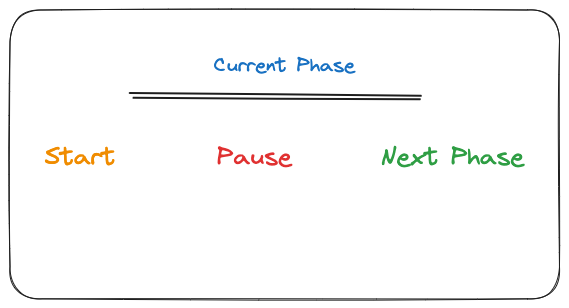

# Main Idea

It will serve as a stand-in for the Table Clock with integrated Pomodoro as i need something to use for the 20-20-20 Rule in the meantime

It will serve as a basic pomodoro and will tell me when to stop working and when to resume the work 
It will also store the number of sessions conducted during a day and the task (Optional)

# Design

It will mimic the hardware design to get a feel of all the bugs we could encounter during the real world use of the same.

So to achieve the same it will have 

- Basic HTML Website with a Notification bar of the Phase

- Button to start

- Button to go to next phase 

- Pause button?

Thats it 
